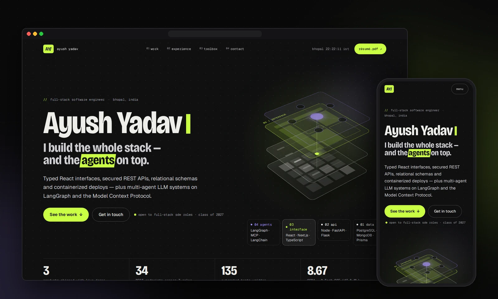
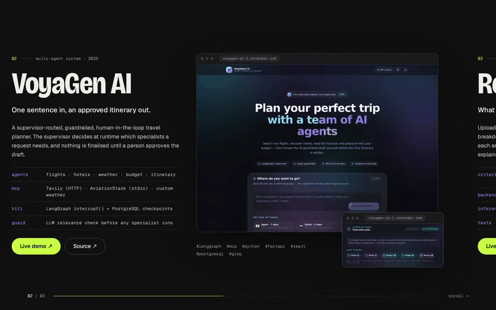
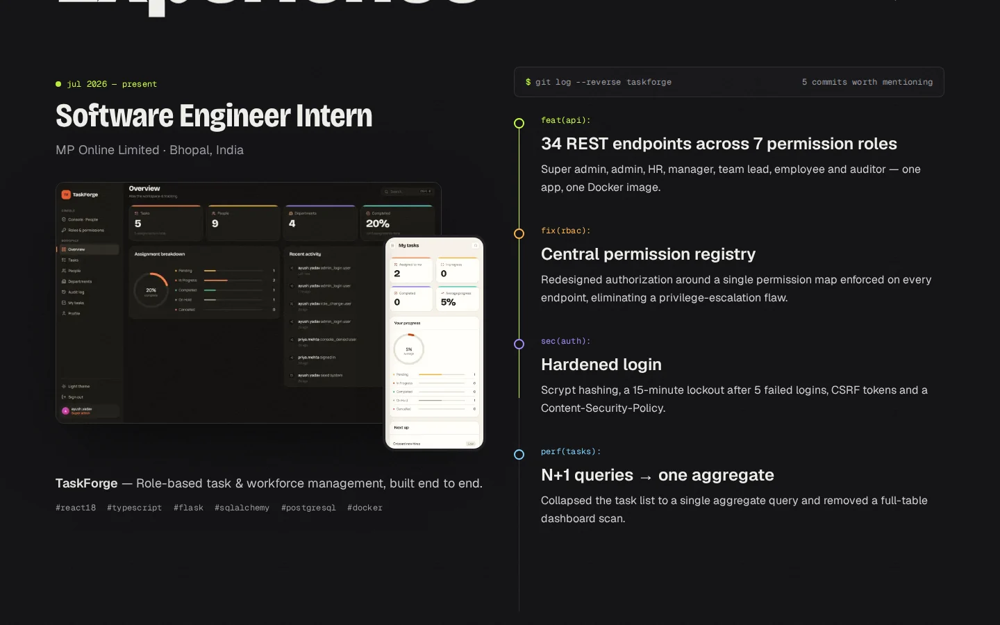
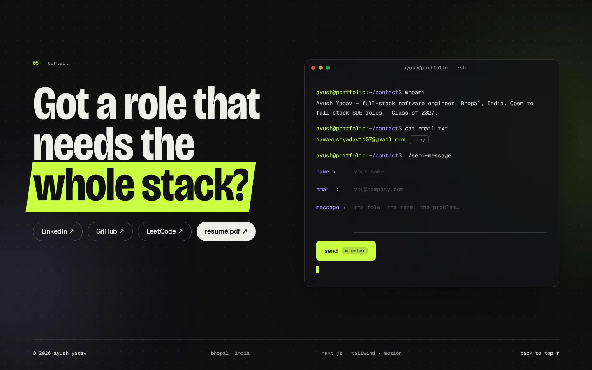
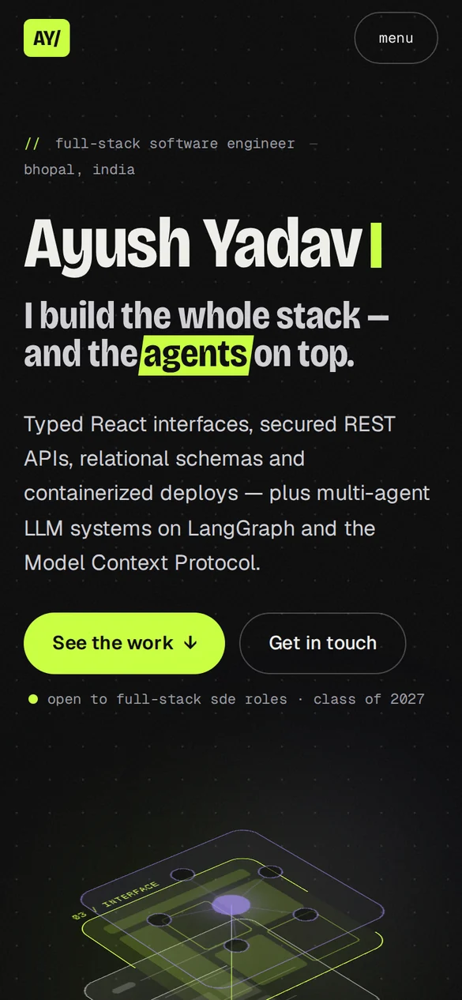

<div align="center">



<h1>Ayush Yadav — Portfolio</h1>

<p><b>I build the whole stack — and the agents on top.</b><br/>
The personal site of a full-stack software engineer: typed React interfaces, secured APIs,<br/>relational data, and multi-agent LLM systems on LangGraph &amp; MCP.</p>

<p>
  
  
  
  
  
  
  
</p>

<p>
  <!-- Add once deployed: <a href="https://YOUR-DOMAIN"><b>Live site</b></a> · -->
  <a href="public/Ayush_Yadav_Resume.pdf"><b>Résumé</b></a> ·
  <a href="https://www.linkedin.com/in/ayush-yadav-3a79b2293/"><b>LinkedIn</b></a> ·
  <a href="https://github.com/ayushYadav1107"><b>GitHub</b></a> ·
  <a href="mailto:iamayushyadav1107@gmail.com"><b>Email</b></a>
</p>

</div>

<br/>

## ✦ Highlights

<table>
  <tr>
    <td width="50%" valign="top">
      <h4>🧱 Exploded-stack hero</h4>
      Four glass planes — <i>agents · interface · API · data</i> — built with CSS 3D transforms. They split apart on load and scroll, tilt toward the cursor, and a request packet drops through every layer.
    </td>
    <td width="50%" valign="top">
      <h4>🎞️ Pinned project reel</h4>
      On desktop the work section pins and scrolls sideways through real screenshots in browser frames, each with a spec sheet, stack tags and live-demo links. On phones it becomes a clean vertical list.
    </td>
  </tr>
  <tr>
    <td valign="top">
      <h4>🌿 Experience as a <code>git log</code></h4>
      Internship highlights written as conventional commits — <code>feat(api)</code>, <code>fix(rbac)</code>, <code>sec(auth)</code>, <code>perf(tasks)</code>, <code>ci(docker)</code> — with a commit line that draws itself as you scroll.
    </td>
    <td valign="top">
      <h4>⌨️ Terminal contact form</h4>
      <code>whoami</code>, <code>cat email.txt</code>, <code>./send-message</code>. Posts to a serverless route with Zod validation, a honeypot and per-IP rate limiting, then sends through Resend — with a pre-filled email fallback if sending ever fails.
    </td>
  </tr>
  <tr>
    <td valign="top">
      <h4>✨ Motion with manners</h4>
      A one-second <code>npm run dev</code> boot intro, masked word reveals, a magnetic cursor ring, Lenis smooth scrolling and film grain — all switched off for anyone who prefers reduced motion.
    </td>
    <td valign="top">
      <h4>🔎 Ready to share</h4>
      Auto-generated Open Graph image for LinkedIn/Slack/X, JSON-LD person schema, sitemap, robots, self-hosted fonts and optimized WebP screenshots.
    </td>
  </tr>
</table>

## 🖼️ Screens

<table>
  <tr>
    <td width="50%"></td>
    <td width="50%"></td>
  </tr>
  <tr>
    <td align="center"><sub>Project reel with real screenshots</sub></td>
    <td align="center"><sub>Experience as a commit log</sub></td>
  </tr>
  <tr>
    <td width="50%"></td>
    <td width="50%" align="center"></td>
  </tr>
  <tr>
    <td align="center"><sub>Terminal contact form</sub></td>
    <td align="center"><sub>Mobile</sub></td>
  </tr>
</table>

## 🧰 Built with

| Layer | Tools |
| --- | --- |
| Framework | **Next.js 16** (App Router, Turbopack) · **React 19** · **TypeScript** |
| Styling | **Tailwind CSS v4** · Bricolage Grotesque, Geist & Geist Mono (self-hosted via Fontsource) |
| Motion | **Motion** (Framer Motion) · **Lenis** smooth scroll · CSS 3D transforms |
| Backend | Route Handler `POST /api/contact` · **Zod** · **Resend** |
| Quality | ESLint (`eslint-config-next`) · strict TypeScript · `prefers-reduced-motion` support |

## 🚀 Getting started

> Requires **Node.js 20.9+**.

```bash
git clone https://github.com/ayushYadav1107/Portfolio.git
cd Portfolio
npm install
npm run dev          # → http://localhost:3000
```

| Script | What it does |
| --- | --- |
| `npm run dev` | Start the dev server |
| `npm run build` | Production build |
| `npm start` | Serve the production build |
| `npm run lint` | Lint the project |

## ✉️ Contact form setup

The form works out of the box in development (messages are logged to the terminal). To deliver real email:

1. Sign up at [resend.com](https://resend.com) with the inbox that should receive messages, and create an API key.
2. Copy `.env.example` to `.env.local` and set the key:

   ```env
   RESEND_API_KEY=re_xxxxxxxxxxxx
   # optional
   CONTACT_TO_EMAIL=you@example.com
   CONTACT_FROM_EMAIL="Portfolio <onboarding@resend.dev>"
   NEXT_PUBLIC_SITE_URL=https://your-domain.com
   ```

3. Restart `npm run dev`. In production, add the same variables in your host's settings.

> Until you verify your own domain in Resend, the default `onboarding@resend.dev` sender can only deliver to the address you signed up with — which is exactly what a portfolio inbox needs.

## 🗂️ Project structure

```text
src/
├─ app/
│  ├─ api/contact/route.ts   # POST /api/contact — validation, rate limit, Resend
│  ├─ layout.tsx             # fonts, metadata, JSON-LD, boot intro, cursor
│  ├─ page.tsx               # section order
│  ├─ opengraph-image.tsx    # generated link-preview card
│  └─ globals.css            # theme tokens, grain, dot grid
├─ components/
│  ├─ Hero.tsx · StackScene.tsx   # name, headline, 3D layered stack
│  ├─ Work.tsx                    # pinned horizontal project reel
│  ├─ Sections.tsx                # experience git log, toolbox, receipts
│  ├─ Contact.tsx                 # terminal form + footer
│  └─ Nav · Boot · Cursor · SmoothScroll · motion helpers
└─ data/profile.ts           # ← every word, link, number and screenshot path
public/
├─ work/                     # project screenshots (WebP)
└─ Ayush_Yadav_Resume.pdf
docs/                        # README images
```

## ✏️ Make it yours

- **Copy, links & numbers** — everything lives in [`src/data/profile.ts`](src/data/profile.ts).
- **Résumé** — replace `public/Ayush_Yadav_Resume.pdf` (keep the name, or update `profile.resume`).
- **Screenshots** — drop WebP/PNG files into `public/work/` and point each project's `hero` / `inset` at them.
- **Colours** — tweak the tokens at the top of [`src/app/globals.css`](src/app/globals.css) (`--color-lime`, `--color-violet`, …).

## ☁️ Deploy

The easiest path is **Vercel**: import this repository at [vercel.com/new](https://vercel.com/new), add the environment variables above, and deploy — no extra configuration needed. Any host that runs Next.js 16 works too.

---

<div align="center">
  <sub>Designed &amp; built by <a href="https://github.com/ayushYadav1107">Ayush Yadav</a> · Bhopal, India · <a href="mailto:iamayushyadav1107@gmail.com">iamayushyadav1107@gmail.com</a></sub>
</div>
